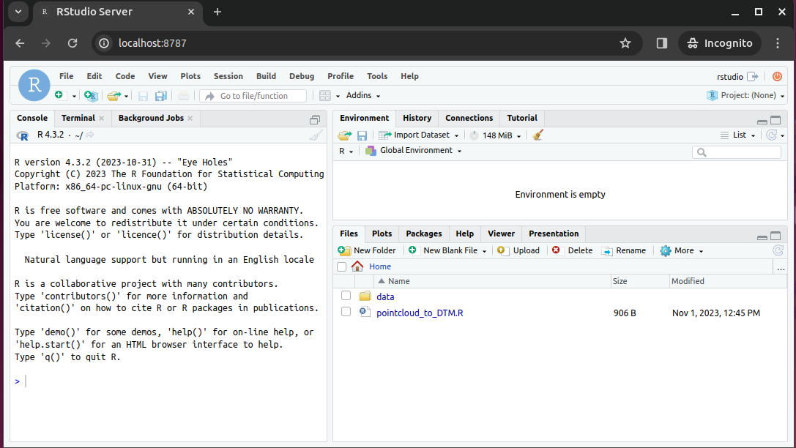

# r-script-containerized

This repo shows a simple demonstration for how to containerize an R script for reproducibility and sharing. This is very useful for researchers to share code with other researchers or to their future selves. Users of the R script can run a single `docker run`  command which will launch an Rstudio server instance which can be accessed through a web browser.The Rstudio server instance will have the R script and all of its dependencies installed. This ensures a consistent environment for running the R script and producing the same results.  

## Run the Container
### 1. Clone this repository to your local machine

`git clone https://github.com/jeffgillan/r-script-containerized.git`

### 2. Change directories into the newly cloned repository

`cd r-script-containerized`

### 3. Run the Container

For Apple arm64 architecture

`docker run --rm -ti -e DISABLE_AUTH=true -v $(pwd):/home/rstudio/data -p 8787:8787 jeffgillan/pointcloud_to_chm:arm64`

For linux amd64 architecture

`docker run --rm -ti -e DISABLE_AUTH=true -v $(pwd):/home/rstudio/data -p 8787:8787 jeffgillan/pointcloud_to_chm:amd64`

### 4. Lauch Rstudio

Open a web browser and go to `localhost:8787`

If everything worked correctly, You should see Rstudio.


### 5. Run the Script

Open the script `pointcloud_to_DTM.R`

Highlight all of the code and click *Run*


Upon completing the code, you should have a 2D plot of the tree


You should also have a new file called `chm.tif` in the mounted `data` folder. The `chm.tif` has been written to your local machine!


#### What does the R-script do?
    
The R script `pointcloud_to_DTM.R` takes a 3D LiDAR point cloud (tree.laz) and produces a 2D Canopy Height Model (CHM.tif). 

```
#Enable packages we will use in this script
library(RCSF)
library(raster)
library(lidR)
library(sp)

#Set working directory to the mounted volume on your local machine
setwd("/home/rstudio/data")

#Bring point cloud into our environment
tree_pointcloud = readLAS("tree.laz")

#Create a canopy height model (CHM) from the 3D points. Resolution of 10 cm. 
CHM = rasterize_canopy(tree_pointcloud, res = 0.1, algorithm = p2r(), pkg = "raster")

# Plot the 2D raster CHM
plot(CHM)

#Write the the raster CHM out to the mounted volume on your local machine
writeRaster(CHM, filename="CHM.tif", format="GTiff", datatype='FLT4S', overwrite=TRUE)

```

## How to Containerize with Docker

Containerization begins with the creation of a dockerfile.

`touch dockerfile`

As a starting point we should use an existing docker image to build on. If you are building from a linux amd64 system, use the existing Docker image [rocker/geospatial:4.2.3](https://hub.docker.com/r/rocker/geospatial). If you are building from a MacOS arm64 system use the existing Docker image [jeffgillan/rstudio_geospatial:1.0](https://hub.docker.com/repository/docker/jeffgillan/rstudio_geospatial/general).


```
#Use the rocker/geospatial image as the base image. This image contains most of the software dependencies we need for our R script.
FROM rocker/geospatial:latest

WORKDIR /home/rstudio

#Install an additional R package that is not included in the rocker/geospatial image
RUN R -e "install.packages('RCSF', dependencies=TRUE, repos='http://cran.rstudio.com/')"

#Copy the R script into the container. It will be copyed to the working directory specified above.
COPY pointcloud_to_DTM.R .

#Expose the port the Rstudeo server will run on
EXPOSE 8787

CMD ["/init"]
```

### Build the Docker Image

Within the directory that contains the dockerfile and 'pointcloud_to_DTM.R' run the following command to build the docker image. The -t flag allows us to tag the image with a name and version number. The . at the end of the command tells docker to look in the current directory for the dockerfile.

`docker build -t jeffgillan/pointcloud_to_dtm:1.0 .`

In the command, 'jeffgillan' is the dockerhub username, 'pointcloud_to_dtm' is the name of the image, and '1.0' is the version number.

### Run the Docker Container

`docker run --rm -ti -e DISABLE_AUTH=true -v $(pwd):/home/rstudio/data -p 8787:8787 jeffgillan/pointcloud_to_dtm:1.0`

Within the command we are doing the following:
* `--rm` - Automatically remove the container when it exits
* `-ti` - Allocate a pseudo-TTY connected to the container’s stdin. It gives you an interactive terminal session in the container, allowing you to run commands in the container just as you would in a regular terminal window.
* `-e DISABLE_AUTH=true` - Disable authentication for the Rstudio server
* `-v $(pwd):/home/rstudio/data` - Mount the current working directory to the /home/rstudio/data directory in the container. This allows us to access the data on our local machine from within the container. The directory is where you should have pointcloud .laz files.
* `-p 8787:8787` - Expose port 8787 on the container to port 8787 on the host machine. This allows us to access the Rstudio server from our web browser.
* `jeffgillan/pointcloud_to_dtm:1.0` - The name and version number of the docker image we want to run.

### Access the Rstudio Server
After the `docker run` command, the container should now be running. The terminal should be 'hung' in someway, meaning you can't type anything. This is because the Rstudio server is running in the container. To access the Rstudio server, open a web browser and go to http://localhost:8787.

If everything worked correctly, You should see Rstudio.


The `/home/rstudio` directory should have the rscript 'pointcloud_to_DTM.R'. If you click on the file, it should open the script in the upperleft portion of the GUI. 

Also in the `/home/rstudio/` directory is the `data` directory. This should be the mounted volume from your local machine that you attached to the container during `docker run...`You will use this data in the script. Outputs from the script will be put in this directory. 


### Environment
This Docker image should have all the software needed to run the script. All the user has to do is supply the data (in this case a .laz point cloud). 

You can see environment details by typying `sessionInfo()`in the Console

```
R version 4.3.2 (2023-10-31)
Platform: x86_64-pc-linux-gnu (64-bit)
Running under: Ubuntu 22.04.3 LTS

Matrix products: default
BLAS:   /usr/lib/x86_64-linux-gnu/openblas-pthread/libblas.so.3 
LAPACK: /usr/lib/x86_64-linux-gnu/openblas-pthread/libopenblasp-r0.3.20.so;  LAPACK version 3.10.0

locale:
 [1] LC_CTYPE=en_US.UTF-8       LC_NUMERIC=C               LC_TIME=en_US.UTF-8        LC_COLLATE=en_US.UTF-8    
 [5] LC_MONETARY=en_US.UTF-8    LC_MESSAGES=en_US.UTF-8    LC_PAPER=en_US.UTF-8       LC_NAME=C                 
 [9] LC_ADDRESS=C               LC_TELEPHONE=C             LC_MEASUREMENT=en_US.UTF-8 LC_IDENTIFICATION=C       

time zone: Etc/UTC
tzcode source: system (glibc)

attached base packages:
[1] stats     graphics  grDevices utils     datasets  methods   base     

other attached packages:
[1] lidR_4.0.4    raster_3.6-26 sp_2.1-1      RCSF_1.0.2   

loaded via a namespace (and not attached):
 [1] terra_1.7-55       vctrs_0.6.4        cli_3.6.1          rlang_1.1.1        DBI_1.1.3         
 [6] KernSmooth_2.23-22 generics_0.1.3     sf_1.0-14          data.table_1.14.8  glue_1.6.2        
[11] e1071_1.7-13       fansi_1.0.5        grid_4.3.2         abind_1.4-5        classInt_0.4-10   
[16] tibble_3.2.1       lifecycle_1.0.3    compiler_4.3.2     dplyr_1.1.3        codetools_0.2-19  
[21] pkgconfig_2.0.3    Rcpp_1.0.11        rstudioapi_0.15.0  lattice_0.21-9     R6_2.5.1          
[26] tidyselect_1.2.0   class_7.3-22       utf8_1.2.4         parallel_4.3.2     pillar_1.9.0      
[31] magrittr_2.0.3     tools_4.3.2        proxy_0.4-27       rlas_1.6.3         lazyeval_0.2.2    
[36] stars_0.6-4        units_0.8-4   
```

### Upload your Docker Image to Dockerhub
 Once you are happy with your container and have verified it works, you can upload it to Dockerhub. Dockerhub is the official place to park your container so other people (and your future self) can access it. 

 
`docker push jeffgillan/pointcloud_to_dtm:1.0`
